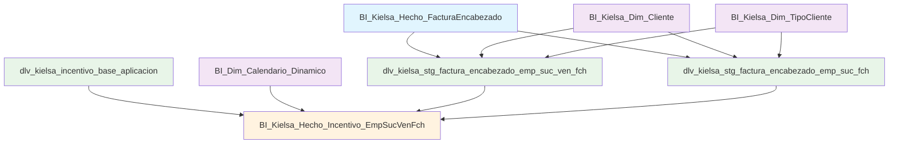
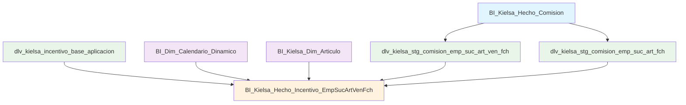

# Diagrama de Flujo de Incentivos Kielsa - Actualizado

## Flujo Principal de Incentivos sin Artículo



## Flujo Existente de Incentivos con Artículo



## Comparación de Modelos

| Aspecto | BI_Kielsa_Hecho_Incentivo_EmpSucArtVenFch | BI_Kielsa_Hecho_Incentivo_EmpSucVenFch |
|---------|---------------------------------------------|------------------------------------------|
| **Dimensiones** | Emp, Suc, Art, Vendedor, Usuario, Fecha | Emp, Suc, Vendedor, Usuario, Fecha |
| **Métricas Base** | Comisiones por artículo | Facturas de aseguradoras |
| **Fuente Principal** | Comisiones de ventas | Facturas de encabezado |
| **Filtro Principal** | Comisión > 0 | TipoCliente LIKE '%ASEGURADO%' |
| **Cálculo Principal** | Comisión * participación | Cantidad facturas * valor_por_receta |
| **Unique Keys** | 6 campos (incluye Articulo_Id) | 5 campos (sin Articulo_Id) |
| **Uso** | Incentivos basados en comisiones | Incentivos por recetas de seguro |

## Tablas y Relaciones Clave

### Nuevas Vistas de Staging
- **dlv_kielsa_stg_factura_encabezado_emp_suc_ven_fch**: Facturas aseguradoras por vendedor
- **dlv_kielsa_stg_factura_encabezado_emp_suc_fch**: Facturas aseguradoras por sucursal

### Filtros y Joins Importantes
```sql
-- Filtro principal para aseguradoras
WHERE TC.TipoCliente_Nombre LIKE '%ASEGURADO%'

-- Join con base de incentivos
LEFT JOIN FacturasAgrupadaVen AS FAV
    ON BI.emp_id = FAV.Emp_Id
    AND BI.suc_id = FAV.Suc_Id
    AND CAL.Fecha_Id = FAV.Fecha_Id
    AND BI.vendedor_id = FAV.Vendedor_Id
```

### Métricas Calculadas
- **Cantidad_Facturas_Aseguradas**: Conteo de facturas únicas de aseguradoras
- **Cantidad_Clientes_Asegurados**: Conteo de clientes únicos asegurados
- **Incentivo_Recetas_Seguro**: Cantidad facturas × valor_por_receta_seguro
